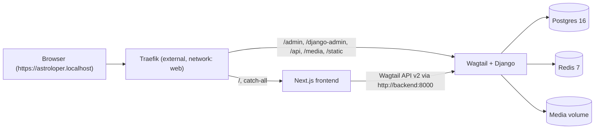

# Architecture

## Overview



- Wagtail is fully **headless**. The Wagtail admin (`/admin`) is the only browser-facing view served by Django; every content page is rendered by Next.js against the [Wagtail API v2](https://docs.wagtail.org/en/stable/advanced_topics/api/v2/).
- **Traefik** lives outside this project (its own compose stack) and owns the shared external Docker network `web`. Backend and frontend join that network and expose themselves purely via Traefik labels.
- **Path-based routing** on a single host so the frontend and admin appear on the same origin. This keeps CSRF/cookie handling simple and enables Next.js Draft Mode to hit the API without CORS.
- **HTTPS by default** on Traefik's TLS entrypoint (usually 443). `astroloper.localhost` is RFC-6761 reserved so browsers resolve `*.localhost` to `127.0.0.1` automatically — no `/etc/hosts` entry required. The self-signed cert triggers a first-visit browser warning. The entrypoint name is configurable via `TRAEFIK_ENTRYPOINT` in `.env` so it matches whatever your standalone Traefik calls it (`https`, `websecure`, `secure`, etc.).

## Request routing

| Path prefix                                                    | Handled by | Priority |
| -------------------------------------------------------------- | ---------- | -------- |
| `/admin`, `/django-admin`, `/api`, `/media`, `/static`         | Wagtail    | 100      |
| everything else                                                | Next.js    | 1        |

Routers are declared as Docker labels on the `backend` and `frontend` services in [`docker-compose.yml`](../docker-compose.yml). Priority 100 on the backend router guarantees the more specific paths win over the frontend catch-all.

## Backend layout

The Django project package is generic (`project/`). All content lives in a single Django app called `models/`.

```
backend/
  project/
    settings/{base,dev,staging,production}.py
    urls.py  wsgi.py  asgi.py
  models/                    # single Django app: INSTALLED_APPS = ["models"]
    apps.py                  # ModelsConfig
    models.py                # shim that re-exports concrete models
    migrations/              # ONE migrations directory for the whole content layer
    mixins/                  # abstract SEO / timestamp mixins
    pages/                   # Wagtail Page subclasses (home.py, blog.py, ...)
    snippets/                # @register_snippet models
    settings/                # Wagtail BaseSiteSetting + menu models
    streamfield/             # StreamField block classes (not Django models)
  docker/{Dockerfile,Dockerfile.dev,entrypoint.sh}
```

### The `models/models.py` shim

Django loads model classes from `<app>.models`. Because our app is *called* `models`, that lookup path is `models.models`. The shim file re-exports every concrete model from the subpackages so Django's app registry can find them:

```python
# models/models.py
from .pages.home import HomePage
from .pages.blog import BlogIndexPage, BlogPage
from .snippets.author import Author
from .snippets.tag import Tag
from .settings.site import SiteSettings
from .settings.menus import MainMenu, FooterMenu
```

**Rule**: every new concrete model gets one import line here. Abstract mixins in `models/mixins/` don't need to be imported (they don't create tables).

Every concrete model also sets `class Meta: app_label = "models"` so Django registers it under the right app label regardless of the file path.

## Frontend layout

Next.js App Router with a catch-all route that queries Wagtail's `/api/v2/pages/find/?html_path=...` and dispatches on the returned `meta.type`.

```
frontend/src/
  app/
    layout.tsx  page.tsx  globals.css
    [...slug]/page.tsx           # catch-all -> Wagtail page detail
    api/preview/route.ts         # Next.js draft mode entry
  components/
    ui/                          # shadcn primitives
    blocks/                      # one component per Wagtail Page/Block type
  lib/wagtail.ts                 # typed Wagtail API v2 client
```

Server components fetch from `WAGTAIL_API_URL=http://backend:8000` (internal Docker DNS, no TLS overhead). Browser-side URLs use `NEXT_PUBLIC_SITE_URL=https://astroloper.localhost`.

## Environments

Same Docker images across environments; only compose overrides and Ansible variables differ.

| Environment  | Compose file                     | Django settings              | Host                             |
| ------------ | -------------------------------- | ---------------------------- | -------------------------------- |
| development  | `docker-compose.dev.yml`         | `project.settings.dev`       | `astroloper.localhost`           |
| staging      | `docker-compose.staging.yml`     | `project.settings.staging`   | `staging.example.com` (TODO)     |
| production   | `docker-compose.prod.yml`        | `project.settings.production`| `example.com` (TODO)             |

### Configuration

Config is delivered identically in every environment: `group_vars/<env>` (vars + encrypted vault) → j2 templates in the Ansible `app` role → three rendered `.env` files. The top-level `.env` is Compose `${VAR}` interpolation only (labels, network, `POSTGRES_*`); `backend/.env` and `frontend/.env` are injected into the containers via each service's `env_file:` (`required: false`). Per-env `docker-compose.<env>.yml` `environment:` entries override the `env_file` values where needed. `task env` is that same render path. See [DEPLOYMENT.md](DEPLOYMENT.md#configuration-flow) for the full picture.

See [DEPLOYMENT.md](DEPLOYMENT.md) for the Traefik + provisioning story.
